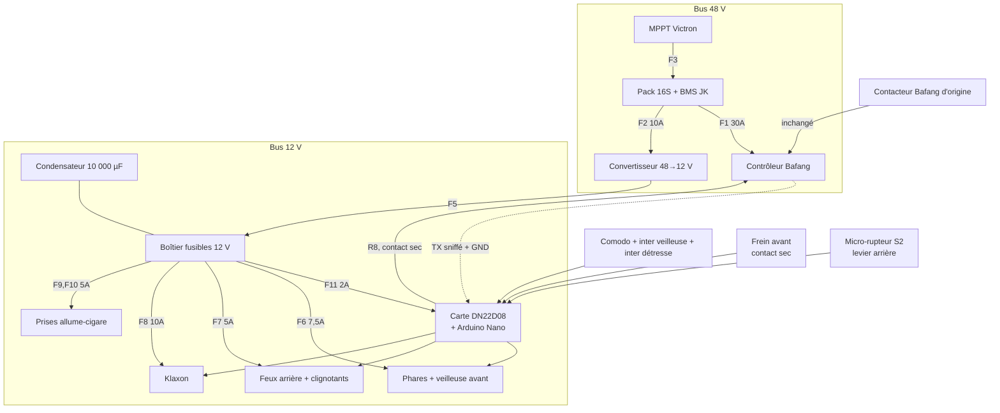

# Plan de câblage

Complément de `specs/03-affectation-es.md` (table d'E/S) et
`specs/04-electricite.md` (puissance, fusibles, sections).

## 1. Vue générale



## 2. Faisceau « commandes » — vers les entrées

Les entrées de la carte sont **NPN** : une borne s'active en la fermant sur la
**masse**. Tous les organes de commande sont donc de simples **contacts secs
vers GND**, et le fil de commun du comodo va à la masse, **pas** au +12 V.

C'est ce qui rend directement utilisable le contacteur de frein avant, qui est
unipolaire.

| Fil | Couleur suggérée | De | Vers | Broche Nano |
|---|---|---|---|---|
| Clignotant gauche | vert | Comodo | IN1 | D2 |
| Clignotant droit | vert/blanc | Comodo | IN2 | D3 |
| Klaxon | rose | Comodo | IN3 | D4 |
| Frein avant | brun | Contacteur AV (contact sec unipolaire) | IN4 | D5 |
| Frein arrière | brun/blanc | Micro-rupteur S2 sur levier AR | IN5 | D6 |
| Veilleuse | jaune | Interrupteur dédié S3 | IN6 | A0 |
| Éclairage fort | bleu | Comodo | IN7 | D12 |
| Détresse | orange | Interrupteur dédié S1 | IN8 | D11 |
| **Masse commune** | noir | Masse châssis | Commun de tous les contacts |

> **Le pinscan tranche avant de sertir quoi que ce soit** (`specs/03` §6,
> étape 4). Si les entrées s'avéraient PNP sur cet exemplaire, le seul
> changement est que le fil de commun va au +12 V au lieu de la masse — le
> firmware, lui, est identique. Mais un faisceau serti à l'envers se
> re-sertit.

## 3. Faisceau « puissance » — depuis les relais

Les huit sorties sont des contacts secs 10 A : les charges se branchent en
direct, sans aucun étage intermédiaire.

| Relais | Vers | Courant |
|---|---|---|
| R1 | Veilleuse avant | 0,8 A |
| R2 | Phares (éclairage fort) | 5,0 A — voir réserve ci-dessous |
| R3 | Clignotant avant gauche **+** arrière gauche | 0,5 A |
| R4 | Clignotant avant droit **+** arrière droit | 0,5 A |
| R5 | Feux de position arrière (les deux en parallèle) | 0,5 A |
| R6 | Feux stop arrière (les deux en parallèle) | 0,5 A |
| R7 | Klaxon | 5–8 A |
| R8 | Ligne frein du contrôleur — **contact sec** | < 50 mA |

> **Réserve sur R2.** 5,0 A si les deux phares totalisent 60 W. Si chacun fait
> 60 W, le courant monte à 10 A, soit le calibre exact du contact — inrush des
> alimentations LED compris. Dans ce cas, intercaler un relais automobile 30 A,
> R2 n'en pilotant que la bobine. Mesurer avant de câbler (test T2.3).

**R5 et R6 sont deux circuits séparés jusqu'aux feux.** Un relais ne module
pas : la distinction entre feu de position et feu stop est entièrement
matérielle, il faut donc soit des feux à deux filaments, soit deux blocs LED
d'intensités différentes.

## 4. Coupure moteur — le point critique

```
Levier arrière ──┬── Contacteur Bafang d'origine ──┐
                 │   (connecteur jaune 3 br.,      │
                 │    INTACT, non dérivé)          │
                 │                                 ├──> Connecteur FREIN
                 └── Micro-rupteur S2 ──> IN5      │     du contrôleur
                                                    │
Levier avant ────── Contacteur unipolaire ──> IN4   │
                                                    │
R8 (contact sec, via dérivation en Y) ──────────────┘
```

### Ce qui coupe quoi

| Freinage | Chemin de coupure | Dépend de l'Arduino ? |
|---|---|---|
| Arrière | Contacteur Bafang d'origine | **Non** |
| Arrière | R8, via S2 et le firmware | Oui (redondant) |
| Avant | R8 uniquement | **Oui** |

**Freiner du seul levier avant ne coupe pas l'assistance si l'Arduino est en
panne.** C'est la conséquence directe du contacteur unipolaire disponible :
un contact ne peut pas à la fois informer la carte et fermer la ligne frein.
Analyse complète et remède en `specs/07-securite.md` §2. Le remède tient en un
micro-rupteur supplémentaire sur le levier avant, câblé en parallèle sur la
ligne frein.

### Câblage de R8

Dérivation en **Y** au format Higo sur le connecteur jaune, sans couper le
faisceau — le montage reste réversible. Mesurer d'abord le fil signal :

| Au multimètre, fil signal / masse | Câblage de R8 |
|---|---|
| ~5 V au repos, ~0 V au freinage *(cas courant)* | Contact **NO**, entre signal et masse |
| ~0 V au repos, ~5 V au freinage | Contact **NC**, en série sur le signal |

R8 est un contact sec : il **n'injecte aucun potentiel**, ce qui est
exactement l'avantage que les relais ont apporté sur la conception initiale à
optocoupleur.

### La règle absolue

> **Ne jamais raccorder la ligne frein Bafang à une borne d'entrée de la
> carte.** Les entrées sont tirées au +12 V à travers la LED de leur
> optocoupleur : on injecterait 12 V dans une entrée 5 V du contrôleur.
> Destruction probable. C'est précisément pourquoi le frein arrière est lu par
> un micro-rupteur séparé (S2) et non par une dérivation du connecteur jaune.

Le test T2.4 vérifie que le moteur se coupe **Arduino débranché** au frein
arrière. S'il échoue, le câblage est à reprendre avant toute sortie.

## 5. Interface de lecture de la ligne frein *(optionnelle, si S2 est refusé)*

Cette interface lit la ligne frein Bafang **sans lui imposer de potentiel**,
et remplace donc le micro-rupteur S2. Elle coûte quatre composants et une
intervention sur le faisceau moteur, pour remplacer un rupteur à 2 € : elle
n'est là que pour le cas où l'ajout d'un rupteur serait impossible.


```
Ligne frein Bafang
(5 V au repos, 0 V au freinage)
        │
       R1 10k
        │
        ├── R2 10k ── GND
        │
      Q1 base (BC547)          Q1 émetteur ── GND
        │
      Q1 collecteur ── R3 10k ── Q2 grille (P-MOSFET)
                                 Q2 grille ── R4 100k ── +12 V
                                 Q2 source ── +12 V
                                 Q2 drain  ── borne IN5
```

Logique obtenue : **entrée active = frein relâché**, à compenser par
`IN_INVERT_BRAKE_REAR 1` dans `config.h` (la sortie va sur `IN5`, pas `IN4`). Une rupture de fil fait retomber
l'entrée, donc le firmware conclut « freinage » — état sûr.

## 6. Piquage UART Bafang

```
Contrôleur ── TX ──┬──────────────> Afficheur (inchangé)
                   │
                  1 kΩ
                   │
                   └──────────────> A4 du Nano

Contrôleur ── GND ────────────────> GND de la carte DN22D08
```

- **Ne toucher qu'aux fils données et masse.** Le fil d'alimentation du
  connecteur afficheur porte la tension batterie sur certains modèles.
- La broche A5 est réservée par `SoftwareSerial` comme TX : **la laisser en
  l'air**. C'est ce qui rend l'émission physiquement impossible.
- A4 et A5 sont les deux seules broches libres capables d'interruption sur
  changement d'état, donc les seules utilisables en réception logicielle.
- Utiliser une dérivation en Y sur un connecteur au format d'origine plutôt
  que de couper le faisceau : le montage reste réversible.

## 7. Ordre de montage recommandé

1. **Inverseur de la carte sur `PRO`.** Avant tout le reste : sinon le
   téléversement échoue et l'on cherche la panne ailleurs (`specs/03` §2 bis).
2. Boîtier calculateur, carte DN22D08, alimentation 12 V seule. Test T2.2.
3. **Croquis `pinscan` d'abord** : chaîne de registres, ordre des relais,
   entrées **et leur polarité**, boutons. Rien d'autre ne se câble avant
   d'avoir validé cette étape — c'est elle qui dit si les communs du faisceau
   vont à la masse ou au +12 V.
4. Faisceau commandes (entrées), commun à la masse.
5. Éclairage, un circuit à la fois, directement sur les relais. Mesurer le
   courant des phares : il décide de la présence ou non d'un relais externe.
6. Condensateur tampon 10 000 µF au boîtier fusibles, **puis** klaxon.
7. Contacteurs de frein — **d'abord** vérifier que le connecteur Bafang
   d'origine coupe bien, Arduino débranché (T2.4), **ensuite** seulement S2 et
   les entrées de lecture, **enfin** la dérivation en Y de R8.
8. Piquage UART en dernier : c'est la seule fonction dont on peut se passer.

## 8. Témoins au poste de conduite

Le boîtier est sous la coque : l'afficheur 4 digits ne sert qu'à la
maintenance. Les témoins de conduite, s'ils sont souhaités, sont **purement
électriques** et ne consomment ni relais ni broche :

| Témoin | Câblage | Remarque |
|---|---|---|
| Clignotants | LED verte + résistance 1 kΩ / 1 W, en parallèle sur chaque circuit R3 et R4 (une LED par côté, ou une seule sur les deux via deux diodes de découplage) | Le rappel d'oubli reste **audible** au changement de rythme du claquement |
| Veilleuse / phares | LED + résistance en parallèle sur R1 ou R2 | Facultatif |
| Détresse | Un interrupteur à bascule lumineux 12 V pour S1 fait office de témoin | Le plus simple |

Un interrupteur à bascule **lumineux** pour S1 et S3 règle la question sans
aucun câblage supplémentaire : la position du contacteur est le témoin.
