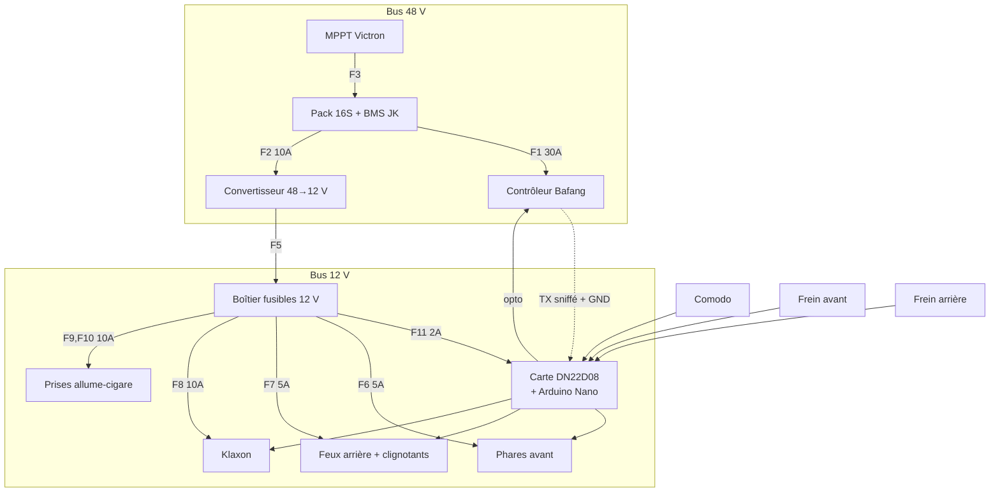

# Plan de câblage

Complément de `specs/03-affectation-es.md` (table d'E/S) et
`specs/04-electricite.md` (puissance, fusibles, sections).

## 1. Vue générale



## 2. Faisceau « commandes » — vers les entrées

Tous les signaux sont du **+12 V commuté** vers la borne d'entrée
correspondante, masse commune avec la carte.

| Fil | Couleur suggérée | De | Vers | Broche Nano |
|---|---|---|---|---|
| Clignotant gauche | vert | Comodo | IN1 | D2 |
| Clignotant droit | vert/blanc | Comodo | IN2 | D3 |
| Klaxon | rose | Comodo | IN3 | D4 |
| Frein avant | brun | Contacteur AV | IN4 | D5 |
| Frein arrière | brun/blanc | Contacteur AR | IN5 | D6 |
| Éclairage / croisement | jaune | Comodo | IN6 | A0 |
| Feu de route | bleu | Comodo | IN7 | D12 |
| Détresse | orange | Interrupteur S1 | IN8 | D11 |
| +12 V commodo | rouge | F11 | Commun comodo |
| Masse | noir | Masse châssis | Commun |

## 3. Faisceau « puissance » — depuis les relais

Les huit sorties sont des contacts secs 10 A : les charges se branchent en
direct, sans aucun étage intermédiaire.

| Relais | Vers | Courant |
|---|---|---|
| R1 | Feu de croisement | 1,7 A |
| R2 | Feu de route | 1,7 A |
| R3 | Clignotant avant gauche **+** arrière gauche | 0,5 A |
| R4 | Clignotant avant droit **+** arrière droit | 0,5 A |
| R5 | Feux de position arrière (les deux en parallèle) | 0,5 A |
| R6 | Feux stop arrière (les deux en parallèle) | 0,5 A |
| R7 | Klaxon | 5–8 A |
| R8 | Ligne frein du contrôleur — **contact sec** | < 50 mA |

**R5 et R6 sont deux circuits séparés jusqu'aux feux.** Un relais ne module
pas : la distinction entre feu de position et feu stop est entièrement
matérielle, il faut donc soit des feux à deux filaments, soit deux blocs LED
d'intensités différentes.

## 4. Coupure moteur — le point critique

```
                  ┌──────────────────────────┐
Contacteur AV ────┤                          │
                  ├──> Connecteur FREIN ──────> Contrôleur Bafang
Contacteur AR ────┤    du contrôleur         │
                  │                          │
R8 (contact sec) ─┘                          │
                  └──────────────────────────┘
```

Les trois chemins sont **en parallèle**, tous en contact sec. N'importe lequel
suffit à couper l'assistance.

Le relais R8 est galvaniquement isolé par construction : le problème qui
imposait un optocoupleur dans la version initiale de ce plan a disparu de
lui-même avec le passage aux relais.

Une règle demeure : **ne jamais injecter de 12 V dans le connecteur frein.**
C'est un circuit ~5 V référencé à la masse du contrôleur. Si un contacteur doit
à la fois alimenter une entrée de la carte et fermer la ligne frein, il faut un
contacteur **bipolaire** — deux circuits isolés.

Le test T2.4 du plan de tests vérifie que le moteur se coupe **Arduino
débranché**. S'il échoue, le câblage est à reprendre avant toute sortie.

## 5. Interface de lecture de la ligne frein (variante A)

```
Ligne frein Bafang
(5 V au repos, 0 V au freinage)
        │
       R1 10k
        │
        ├── R2 10k ── GND
        │
      Q1 base (BC547)          Q1 émetteur ── GND
        │
      Q1 collecteur ── R3 10k ── Q2 grille (P-MOSFET)
                                 Q2 grille ── R4 100k ── +12 V
                                 Q2 source ── +12 V
                                 Q2 drain  ── borne IN4
```

Logique obtenue : **entrée active = frein relâché**, à compenser par
`IN_INVERT_BRAKE_FRONT 1` dans `config.h`. Une rupture de fil fait retomber
l'entrée, donc le firmware conclut « freinage » — état sûr.

## 6. Piquage UART Bafang

```
Contrôleur ── TX ──┬──────────────> Afficheur (inchangé)
                   │
                  1 kΩ
                   │
                   └──────────────> A4 du Nano

Contrôleur ── GND ────────────────> GND de la carte DN22D08
```

- **Ne toucher qu'aux fils données et masse.** Le fil d'alimentation du
  connecteur afficheur porte la tension batterie sur certains modèles.
- La broche A5 est réservée par `SoftwareSerial` comme TX : **la laisser en
  l'air**. C'est ce qui rend l'émission physiquement impossible.
- A4 et A5 sont les deux seules broches libres capables d'interruption sur
  changement d'état, donc les seules utilisables en réception logicielle.
- Utiliser une dérivation en Y sur un connecteur au format d'origine plutôt
  que de couper le faisceau : le montage reste réversible.

## 7. Ordre de montage recommandé

1. Boîtier calculateur, carte DN22D08, alimentation 12 V seule. Test T2.2.
2. **Croquis `pinscan` d'abord** : chaîne de registres, ordre des relais,
   entrées, boutons. Rien d'autre ne se câble avant d'avoir validé cette étape.
3. Faisceau commandes (entrées).
4. Éclairage, un circuit à la fois, directement sur les relais.
5. Klaxon.
6. Contacteurs de frein — **d'abord** la liaison directe au contrôleur, testée
   Arduino débranché (T2.4), **ensuite** seulement les entrées de lecture.
7. Piquage UART en dernier : c'est la seule fonction dont on peut se passer.
