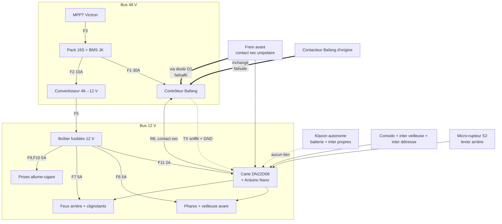

# Plan de câblage

Complément de `specs/03-affectation-es.md` (table d'E/S) et
`specs/04-electricite.md` (puissance, fusibles, sections).

## 1. Vue générale



## 2. Faisceau « commandes » — vers les entrées

Les entrées de la carte sont **NPN** — confirmé par la fiche du constructeur :
« 8x opto-isolated inputs (low level trigger, NPN type) ». Une borne s'active
en la fermant sur la **masse**. Tous les organes de commande sont donc de
simples **contacts secs vers GND**, et le fil de commun du comodo va à la
masse, **pas** au +12 V.

C'est ce qui rend directement utilisable le contacteur de frein avant, qui est
unipolaire.

| Fil | Couleur suggérée | De | Vers | Broche Nano |
|---|---|---|---|---|
| Clignotant gauche | vert | Comodo | IN1 | D2 |
| Clignotant droit | vert/blanc | Comodo | IN2 | D3 |
| *(libre)* | — | — | **IN3** | D4 |
| Frein avant | brun | Contacteur AV (contact sec unipolaire) | IN4 | D5 |
| Frein arrière | brun/blanc | Micro-rupteur S2 sur levier AR | IN5 | D6 |
| Veilleuse | jaune | Interrupteur dédié S3 | IN6 | A0 |
| Éclairage fort | bleu | Comodo | IN7 | D12 |
| Détresse | orange | Interrupteur dédié S1 | IN8 | D11 |
| **Masse commune** | noir | Masse châssis | Commun de tous les contacts |

> Le pinscan reste à dérouler (`specs/03` §6, étape 4), mais il ne s'agit plus
> que d'une confirmation de trente secondes : la polarité est donnée par le
> constructeur.

## 3. Faisceau « puissance » — depuis les relais

Les huit sorties sont des contacts secs 10 A : les charges se branchent en
direct, sans aucun étage intermédiaire.

| Relais | Vers | Courant |
|---|---|---|
| R1 | Veilleuse avant | 0,8 A |
| R2 | Phares (éclairage fort) | 2,5 A **mesurés** |
| R3 | Clignotant avant gauche **+** arrière gauche | 0,5 A |
| R4 | Clignotant avant droit **+** arrière droit | 0,5 A |
| R5 | Feux de position arrière (les deux en parallèle) | 0,5 A |
| R6 | Feux stop arrière (les deux en parallèle) | 0,5 A |
| R7 | **Libre** | — |
| R8 | Ligne frein du contrôleur — **contact sec** | < 50 mA |

> Mesure à la pince : **12 W par phare**, et non les 60 W annoncés. R2 voit
> 2,5 A pour un calibre de 10 A. Aucun relais externe n'est nécessaire.

**R5 et R6 sont deux circuits séparés jusqu'aux feux.** Un relais ne module
pas : la distinction entre feu de position et feu stop est entièrement
matérielle, il faut donc soit des feux à deux filaments, soit deux blocs LED
d'intensités différentes.

## 4. Coupure moteur — le point critique

### Le problème posé par le contacteur avant

Le contacteur de frein avant est un contact sec **unipolaire** : un seul jeu de
contacts. Il ne peut pas à la fois informer la carte (borne `IN4`) et fermer la
ligne frein du contrôleur. Poser un second micro-rupteur sur le levier n'est
pas praticable proprement.

**Une diode résout entièrement le problème**, et elle se monte **dans le
boîtier du calculateur** — rien à modifier au levier, aucun fil supplémentaire
à faire courir jusqu'au guidon.

### Pourquoi ça marche

Les deux circuits veulent exactement la même chose : que quelque chose soit
tiré **à la masse**.

- L'entrée `IN4` est NPN : elle s'active quand sa borne est mise à la masse.
- La ligne frein Bafang coupe l'assistance quand son signal est mis à la masse.

Un seul contact peut donc servir les deux, **à condition d'empêcher le +12 V
de la carte d'atteindre la ligne 5 V du contrôleur** quand le contact est
ouvert. C'est le seul rôle de la diode.

```
                                         ┌─────────── borne IN4
                                         │            (tirée à +12 V en interne
Contacteur                               │             par son optocoupleur)
frein avant ──────────────── N ──────────┤
     │                                   │
     │                                D1 │ 1N4148
    GND                            ──────┤ cathode côté N
                                         │
                                         └─────────── signal frein Bafang
                                                      (via la dérivation en Y)
```

| Contact | Nœud N | Diode | Entrée IN4 | Ligne Bafang |
|---|---|---|---|---|
| **Ouvert** | ~12 V | bloquée (anode 5 V < cathode 12 V) | inactive | **intacte, isolée du 12 V** |
| **Fermé** | 0 V | passante | active | tirée à ~0,6 V → assistance coupée |

Les 0,6 V de chute directe sont très en dessous du seuil de basculement d'une
entrée logique 5 V. En sens inverse, le courant de fuite d'une 1N4148 est de
l'ordre de quelques dizaines de nanoampères : la ligne du contrôleur ne bouge
pas d'un millivolt mesurable.

> **Ne pas utiliser de Schottky ici**, malgré sa chute plus faible. Son courant
> de fuite inverse, qui peut atteindre le milliampère à chaud, ferait remonter
> le potentiel de la ligne frein. La 1N4148 est le bon choix précisément parce
> qu'elle fuit peu.

### Ce que ça rétablit

Les trois chemins de coupure redeviennent parallèles, et **deux d'entre eux ne
passent pas par l'Arduino** :

```
Levier arrière ──┬── Contacteur Bafang d'origine ────┐
                 │   (connecteur jaune, INTACT)      │
                 └── Micro-rupteur S2 ──> IN5        │
                                                     ├──> Connecteur FREIN
Levier avant ────── Contacteur unipolaire ──┬──> IN4 │     du contrôleur
                                            └── D1 ──┤
                                                     │
R8 (contact sec, via la dérivation en Y) ────────────┘
```

| Freinage | Chemins de coupure | Indépendant de l'Arduino ? |
|---|---|---|
| Arrière | Contacteur d'origine, **+** R8 | **Oui** |
| Avant | **D1**, **+** R8 | **Oui** |

Le principe P1 est intégralement rétabli, pour une diode à 5 centimes.

### Prérequis : mesurer la polarité avant de souder

Tout ce qui précède suppose que la ligne frein Bafang est **active à l'état
bas**, ce qui est le cas courant. À vérifier au multimètre sur le fil signal du
connecteur jaune, par rapport à la masse :

| Mesure | Câblage |
|---|---|
| ~5 V au repos, ~0 V au freinage *(cas courant)* | **D1 comme ci-dessus**, et R8 en contact **NO** entre signal et masse |
| ~0 V au repos, ~5 V au freinage | **D1 est inopérante** : la retirer. R8 en contact **NC**, en série sur le signal. Le frein avant redevient dépendant du firmware |

### Câblage physique

- **La diode vit dans le boîtier**, sur le bornier, entre la borne `IN4` et le
  fil qui part vers la dérivation en Y. Gaine thermorétractable, et c'est fini.
- **Dérivation en Y** au format Higo sur le connecteur jaune, sans couper le
  faisceau : le montage reste réversible. Ce fil existe déjà pour R8.
- La masse du contacteur avant peut être prise sur la masse du véhicule : le
  convertisseur étant non isolé, c'est la même que celle du contrôleur.
- **Attention au sens de la diode.** Cathode (l'anneau imprimé) côté `IN4`.
  Montée à l'envers, elle n'endommage rien mais ne fait rien non plus : le
  frein avant ne coupera pas l'assistance. Le test T2.4 le détecte.

### La règle absolue, qui ne change pas

> **Ne jamais raccorder la ligne frein Bafang à une borne d'entrée de la carte
> sans diode.** Les entrées sont tirées au +12 V à travers la LED de leur
> optocoupleur : on injecterait 12 V dans une entrée 5 V du contrôleur.
> Destruction probable. C'est exactement ce que D1 empêche, et c'est aussi
> pourquoi le frein arrière est lu par un micro-rupteur séparé (S2) plutôt que
> par une dérivation directe du connecteur jaune.

Le test T2.4 vérifie que le moteur se coupe **Arduino débranché**, aux deux
freins. S'il échoue, le câblage est à reprendre avant toute sortie.

## 5. Interface de lecture de la ligne frein *(optionnelle, si S2 est refusé)*

Cette interface lit la ligne frein Bafang **sans lui imposer de potentiel**,
et remplace donc le micro-rupteur S2. Elle coûte quatre composants et une
intervention sur le faisceau moteur, pour remplacer un rupteur à 2 € : elle
n'est là que pour le cas où l'ajout d'un rupteur serait impossible.


```
Ligne frein Bafang
(5 V au repos, 0 V au freinage)
        │
       R1 10k
        │
        ├── R2 10k ── GND
        │
      Q1 base (BC547)          Q1 émetteur ── GND
        │
      Q1 collecteur ── R3 10k ── Q2 grille (P-MOSFET)
                                 Q2 grille ── R4 100k ── +12 V
                                 Q2 source ── +12 V
                                 Q2 drain  ── borne IN5
```

Logique obtenue : **entrée active = frein relâché**, à compenser par
`IN_INVERT_BRAKE_REAR 1` dans `config.h` (la sortie va sur `IN5`, pas `IN4`). Une rupture de fil fait retomber
l'entrée, donc le firmware conclut « freinage » — état sûr.

## 6. Piquage UART Bafang

```
Contrôleur ── TX ──┬──────────────> Afficheur (inchangé)
                   │
                  1 kΩ
                   │
                   └──────────────> A4 du Nano

Contrôleur ── GND ────────────────> GND de la carte DN22D08
```

- **Ne toucher qu'aux fils données et masse.** Le fil d'alimentation du
  connecteur afficheur porte la tension batterie sur certains modèles.
- La broche A5 est réservée par `SoftwareSerial` comme TX : **la laisser en
  l'air**. C'est ce qui rend l'émission physiquement impossible.
- A4 et A5 sont les deux seules broches libres capables d'interruption sur
  changement d'état, donc les seules utilisables en réception logicielle.
- Utiliser une dérivation en Y sur un connecteur au format d'origine plutôt
  que de couper le faisceau : le montage reste réversible.

## 7. Ordre de montage recommandé

1. **Inverseur de la carte sur `PRO`.** Avant tout le reste : sinon le
   téléversement échoue et l'on cherche la panne ailleurs (`specs/03` §2 bis).
2. Boîtier calculateur, carte DN22D08, alimentation 12 V seule. Test T2.2.
3. **Croquis `pinscan` d'abord** : chaîne de registres, ordre des relais,
   entrées **et leur polarité**, boutons. Rien d'autre ne se câble avant
   d'avoir validé cette étape — c'est elle qui dit si les communs du faisceau
   vont à la masse ou au +12 V.
4. Faisceau commandes (entrées), commun à la masse.
5. Éclairage, un circuit à la fois, directement sur les relais. Mesurer le
   courant des phares : il décide de la présence ou non d'un relais externe.
6. *(Le klaxon est autonome : rien à câbler. Ni fusible F8, ni condensateur
   tampon — c'était la seule charge qui justifiait ce dernier.)*
7. Contacteurs de frein — **d'abord** vérifier que le connecteur Bafang
   d'origine coupe bien, Arduino débranché (T2.4), **ensuite** seulement S2 et
   les entrées de lecture, **enfin** la dérivation en Y de R8.
8. Piquage UART en dernier : c'est la seule fonction dont on peut se passer.

## 8. Témoins au poste de conduite

Le boîtier est sous la coque : l'afficheur 4 digits ne sert qu'à la
maintenance. Les témoins de conduite, s'ils sont souhaités, sont **purement
électriques** et ne consomment ni relais ni broche :

| Témoin | Câblage | Remarque |
|---|---|---|
| Clignotants | LED verte + résistance 1 kΩ / 1 W, en parallèle sur chaque circuit R3 et R4 (une LED par côté, ou une seule sur les deux via deux diodes de découplage) | Le rappel d'oubli reste **audible** au changement de rythme du claquement |
| Veilleuse / phares | LED + résistance en parallèle sur R1 ou R2 | Facultatif |
| Détresse | Un interrupteur à bascule lumineux 12 V pour S1 fait office de témoin | Le plus simple |
| **Défaut** | LED rouge + résistance sur **R7**, la voie laissée libre par le klaxon | Voir Q14 : c'est le meilleur usage proposé pour ce relais |

Un interrupteur à bascule **lumineux** pour S1 et S3 règle la question sans
aucun câblage supplémentaire : la position du contacteur est le témoin.
