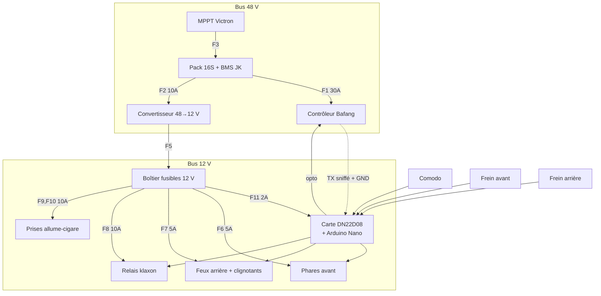

# Plan de câblage

Complément de `specs/03-affectation-es.md` (table d'E/S) et
`specs/04-electricite.md` (puissance, fusibles, sections).

## 1. Vue générale



## 2. Faisceau « commandes » — vers les entrées

Tous les signaux sont du **+12 V commuté** vers la borne d'entrée
correspondante, masse commune avec la carte.

| Fil | Couleur suggérée | De | Vers |
|---|---|---|---|
| Clignotant gauche | vert | Comodo | IN1 |
| Clignotant droit | vert/blanc | Comodo | IN2 |
| Klaxon | rose | Comodo | IN3 |
| Frein avant | brun | Contacteur AV | IN4 |
| Frein arrière | brun/blanc | Contacteur AR | IN5 |
| Éclairage / croisement | jaune | Comodo | IN6 |
| Feu de route | bleu | Comodo | IN7 |
| Détresse | orange | Interrupteur S1 | IN8 |
| +12 V commodo | rouge | F11 | Commun comodo |
| Masse | noir | Masse châssis | Commun |

## 3. Faisceau « puissance » — depuis les sorties

| De | Étage | Vers |
|---|---|---|
| OUT1 | M2 (MOSFET) | Feu de croisement |
| OUT2 | M3 (MOSFET) | Feu de route |
| OUT3 | direct | Clignotant avant gauche **+** arrière gauche |
| OUT4 | direct | Clignotant avant droit **+** arrière droit |
| OUT5 | M1 (MOSFET, PWM) | Feux rouges arrière (les deux en parallèle) |
| OUT6 | K1 (relais) | Klaxon |
| OUT7 | OK1 (optocoupleur) | Ligne frein du contrôleur |
| OUT8 | direct | Buzzer BZ1 |

## 4. Coupure moteur — le point critique

```
                  ┌──────────────────────────┐
Contacteur AV ────┤                          │
                  ├──> Connecteur FREIN ──────> Contrôleur Bafang
Contacteur AR ────┤    du contrôleur         │
                  │                          │
OUT7 ─> OK1 ──────┘  (collecteur ouvert)     │
                  └──────────────────────────┘
```

Les trois chemins sont **en parallèle**, tous à collecteur ouvert ou contact
sec. N'importe lequel suffit à couper l'assistance.

Deux règles à ne pas enfreindre :

1. **Ne jamais injecter de 12 V dans le connecteur frein.** C'est un circuit
   ~5 V référencé à la masse du contrôleur. Si un contacteur doit à la fois
   alimenter une entrée 12 V de la carte et fermer la ligne frein, il faut un
   contacteur **bipolaire** — deux circuits isolés.
2. **L'optocoupleur OK1 n'est pas facultatif.** Il isole le 5 V de l'Arduino
   du circuit du contrôleur.

Le test T2.4 du plan de tests vérifie que le moteur se coupe **Arduino
débranché**. S'il échoue, le câblage est à reprendre avant toute sortie.

## 5. Interface de lecture de la ligne frein (variante A)

```
Ligne frein Bafang
(5 V au repos, 0 V au freinage)
        │
       R1 10k
        │
        ├── R2 10k ── GND
        │
      Q1 base (BC547)          Q1 émetteur ── GND
        │
      Q1 collecteur ── R3 10k ── Q2 grille (P-MOSFET)
                                 Q2 grille ── R4 100k ── +12 V
                                 Q2 source ── +12 V
                                 Q2 drain  ── borne IN4
```

Logique obtenue : **entrée active = frein relâché**, à compenser par
`IN_INVERT_BRAKE_FRONT 1` dans `config.h`. Une rupture de fil fait retomber
l'entrée, donc le firmware conclut « freinage » — état sûr.

## 6. Piquage UART Bafang

```
Contrôleur ── TX ──┬──────────────> Afficheur (inchangé)
                   │
                  1 kΩ
                   │
                   └──────────────> D10 du Nano

Contrôleur ── GND ────────────────> GND de la carte DN22D08
```

- **Ne toucher qu'aux fils données et masse.** Le fil d'alimentation du
  connecteur afficheur porte la tension batterie sur certains modèles.
- La broche D11 est réservée par `SoftwareSerial` comme TX : **la laisser en
  l'air**. C'est ce qui rend l'émission physiquement impossible.
- Utiliser une dérivation en Y sur un connecteur au format d'origine plutôt
  que de couper le faisceau : le montage reste réversible.

## 7. Ordre de montage recommandé

1. Boîtier calculateur, carte DN22D08, alimentation 12 V seule. Test T2.2.
2. Faisceau commandes (entrées). Vérification au croquis `pinscan`.
3. Étages de puissance et éclairage, un circuit à la fois.
4. Klaxon et son relais.
5. Contacteurs de frein — **d'abord** la liaison directe au contrôleur, testée
   Arduino débranché (T2.4), **ensuite** seulement les entrées de lecture.
6. Piquage UART en dernier : c'est la seule fonction dont on peut se passer.
