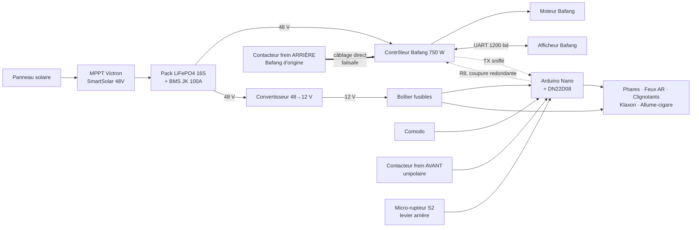

# 00 — Vue d'ensemble

## 1. Contexte

Le VHélio est un vélomobile solaire à assistance électrique. Le guide de montage
officiel décrit un câblage « en dur » : chaque interrupteur alimente directement
sa charge. Ce projet remplace ce câblage par un **calculateur central** qui
centralise la logique (clignotants, feux stop, temporisations, cohérence des
commandes) et ouvre la porte à la télémétrie et au diagnostic.

## 2. Périmètre

### Dans le périmètre

- Éclairage : veilleuse avant, phares, feux rouges arrière (position + stop)
- Signalisation : clignotants gauche / droite, feux de détresse
- Klaxon 12 V
- Détection de freinage (avant + arrière) → feu stop + pause assistance
- Télémétrie moteur en **écoute passive** sur la liaison UART afficheur ↔ contrôleur Bafang
- Diagnostic : autotest au démarrage, journal série, chien de garde

### Hors périmètre

- Toute commande du moteur autre que la ligne « frein » du contrôleur.
  L'assistance, les niveaux PAS et le bridage restent gérés par l'afficheur Bafang.
- La gestion de la batterie : elle est assurée par le BMS JK. L'Arduino ne coupe
  ni ne surveille le pack.
- La charge solaire : le MPPT Victron est autonome.
- L'affichage conducteur : l'afficheur Bafang d'origine est conservé tel quel.
  Le boîtier du calculateur est monté sous la coque, son afficheur 4 digits
  n'est pas lisible en roulant et ne sert qu'à la maintenance.

## 3. Principes directeurs

Ces quatre principes arbitrent toutes les décisions de conception qui suivent.

**P1 — Le firmware n'est jamais un point de défaillance unique pour la sécurité.**
La coupure moteur au freinage est assurée **matériellement** par le câblage du
contacteur de frein sur la ligne frein du contrôleur Bafang. La sortie
`OUT_MOTOR_CUT` de l'Arduino est *redondante*, pas indispensable.

> **Entorse connue et documentée, au frein avant.** Le contacteur avant
> disponible est **unipolaire** : un seul jeu de contacts, qui ne peut pas à la
> fois informer la carte et fermer la ligne frein. Câblé sur l'entrée de la
> carte — parce que le feu stop est prioritaire — il laisse la coupure
> d'assistance au frein avant dépendre du firmware. Le frein **arrière**, lui,
> respecte intégralement P1. Analyse et remède (un micro-rupteur à 2 €) en
> `07-securite.md` §2. C'est la seule entorse du projet à ses propres
> principes, et elle est réparable.

**P2 — La télémétrie est un confort, pas une fonction de sécurité.**
La perte totale du bus Bafang (fil coupé, afficheur débranché, décodage erroné)
n'a aucun effet sur les feux, les clignotants, le stop ou le klaxon. Le module
peut être désactivé à la compilation (`BAFANG_ENABLE 0`) sans rien casser d'autre.

**P3 — État sûr par défaut.**
Au reset, toutes les sorties sont inactives (feux éteints, klaxon coupé,
coupure moteur relâchée). La coupure moteur relâchée au boot est le bon choix
*parce que* P1 garantit la coupure matérielle : un firmware planté ne doit pas
immobiliser le véhicule.

**P4 — Aucun `delay()`, aucune boucle bloquante.**
Le firmware est un ordonnanceur coopératif. Le temps de cycle mesuré doit rester
sous 10 ms pour que la réaction au freinage soit imperceptible.

## 4. Rôles des équipements

| Équipement | Rôle | Interface avec l'Arduino |
|---|---|---|
| **Pack LiFePO4 16S** | Stockage 48 V (51,2 V nom.) | Aucune |
| **BMS JK PB1A16S10P 100 A** | Protection cellules, équilibrage, coupure | Aucune (Bluetooth propre) |
| **MPPT Victron SmartSolar** | Charge solaire du pack 48 V | Aucune en v1 (VE.Direct en évolution) |
| **Convertisseur 48 → 12 V** | Alimente tout le réseau accessoire | Alimente la carte DN22D08 |
| **Contrôleur Bafang 750 W** | Maître de la traction | Ligne frein (entrée), ligne UART TX (sortie, sniffée) |
| **Afficheur Bafang UART** | IHM conducteur, réglage assistance | Aucune (l'Arduino n'écrit jamais sur le bus) |
| **Comodo** | Clignotants, klaxon, éclairage fort | 4 entrées, contacts secs vers la masse |
| **Inters dédiés S1, S3** | Détresse, veilleuse | 2 entrées, contacts secs vers la masse |
| **Contacteur frein avant** | Feu stop (unipolaire) | 1 entrée ; **ne coupe pas** la ligne frein |
| **Contacteur frein arrière Bafang** | Coupure d'assistance native | Aucune — connecteur laissé **intact** |
| **Micro-rupteur S2, levier arrière** | Informe le firmware du freinage arrière | 1 entrée, contact sec |
| **Arduino Nano + DN22D08** | Logique éclairage / signalisation / diagnostic | — |
| **Boîtier fusibles** | Protection de chaque départ 12 V | Aucune |

## 5. Architecture générale

Le trait épais matérialise le principe P1 : au frein **arrière**, le chemin de
sécurité ne passe pas par l'Arduino. Au frein **avant**, il y passe — voir la
réserve du §3 et `07-securite.md` §2.

## 6. Glossaire

| Terme | Définition |
|---|---|
| **Comodo** | Bloc de commandes au guidon (clignotants, klaxon, éclairage) |
| **Ligne frein** | Entrée du contrôleur Bafang qui coupe l'assistance quand elle est fermée à la masse |
| **PAS** | Pedal Assist System — niveau d'assistance sélectionné à l'afficheur |
| **Veilleuse** | Premier niveau d'éclairage : feu de position, avant comme arrière |
| **Higo** | Connecteurs ronds étanches du faisceau Bafang. Le connecteur de frein arrière est jaune, à 3 broches |
| **Stop** | Feu de freinage, plus lumineux que la veilleuse |
| **Sniff** | Écoute passive d'une liaison série, sans jamais émettre |
| **SOC** | State Of Charge — niveau de charge batterie en % |
| **PCINT** | Pin Change Interrupt de l'ATmega328P |
| **DN22D08** | Carte rail DIN 8 entrées optocouplées / 8 **relais**, afficheur 4 digits, support Arduino Nano |
| **NPN (entrée)** | Entrée qui s'active en fermant sa borne sur la **masse**, et non en lui appliquant du +12 V |
