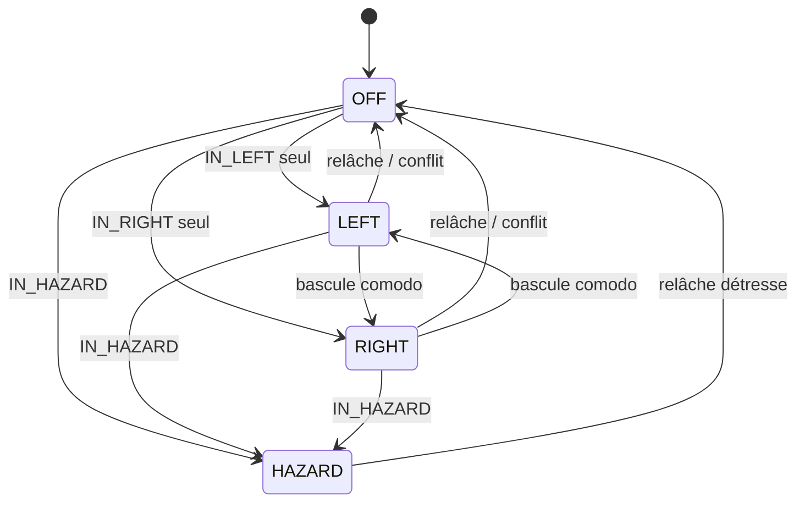
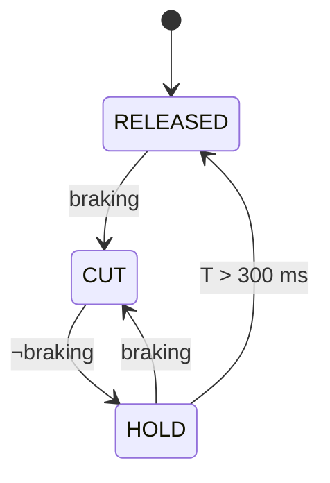
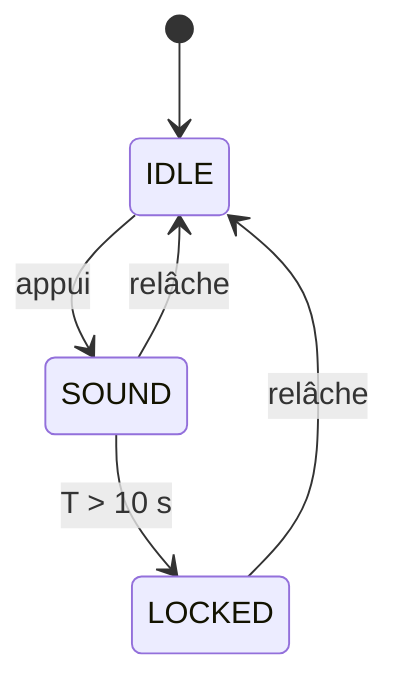

# 02 — Machines à états

Quatre automates indépendants, réévalués à chaque cycle de la boucle principale.
Aucun ne bloque, aucun n'attend.

---

## 2.1 Clignotants / détresse

### États

| État | Signification | OUT3 (gauche) | OUT4 (droite) |
|---|---|---|---|
| `OFF` | Aucune signalisation | 0 | 0 |
| `LEFT` | Clignotant gauche | phase | 0 |
| `RIGHT` | Clignotant droit | 0 | phase |
| `HAZARD` | Détresse | phase | phase |

`phase` vaut 1 pendant les 375 premières ms de chaque période de 750 ms.

### Transitions

L'état est **recalculé à chaque cycle** à partir des niveaux d'entrée (le comodo
est un inverseur maintenu, pas un bouton) :

```
si  IN_HAZARD              -> HAZARD
sinon si IN_LEFT et non IN_RIGHT  -> LEFT
sinon si IN_RIGHT et non IN_LEFT  -> RIGHT
sinon                             -> OFF
```

Le cas « les deux entrées actives » retombe volontairement sur `OFF` : c'est un
défaut de câblage ou de comodo, et il vaut mieux ne rien signaler que signaler
deux directions contradictoires. Ce cas lève le drapeau de défaut `FLT_TURN_CONFLICT`.



### Chronologie de la phase

Le compteur de phase est **remis à zéro à chaque changement d'état**, ce qui
garantit F-3.3 (démarrage sur une phase allumée) et évite un premier flash tronqué.

### Retour sonore

Aucun buzzer. Les clignotants sont portés par les relais R3 et R4, dont le
claquement mécanique à 1,33 Hz **est** le retour sonore — c'est le bruit d'un
relais de clignotant classique. Une sortie et un composant économisés, et le
retour ne peut pas tomber en panne indépendamment du clignotant qu'il annonce.

### Rappel d'oubli (F-3.7)

Un compteur démarre à l'entrée dans `LEFT` ou `RIGHT` (pas en `HAZARD`, qui est
intentionnellement durable). Au-delà de 45 s **ou** 300 m parcourus — si la
vitesse est valide — l'état de rappel est levé. Les clignotants continuent
normalement ; seul leur **rythme** change.

#### Comment il se manifeste

Le boîtier est sous la coque et l'afficheur illisible en roulant (Q12) : le
claquement des relais est le seul canal restant vers le conducteur. Le rappel
l'emprunte, en jouant sur le **rapport cyclique** :

| | Période | Phase allumée | Rapport | Cadence |
|---|---|---|---|---|
| Normal | 750 ms | 375 ms | 50 % | 80 c/min |
| **Rappel** | **750 ms** *(inchangée)* | **200 ms** | 27 % | **80 c/min** |

La période ne bouge pas. Le claquement « fermeture … ouverture » passe d'un
rythme régulier à un rythme syncopé — nettement reconnaissable à l'oreille —
alors que la cadence de clignotement reste dans la plage réglementaire
60–120 cycles/min.

**C'est précisément pourquoi le rappel n'accélère pas la cadence**, ce qui
aurait été la solution automobile habituelle : à 2,7 Hz on sortirait de la
plage réglementaire. On change le rythme, pas la fréquence.

**Contrepartie assumée** : le feu est allumé 27 % du temps au lieu de 50 %,
donc un peu moins visible. Acceptable parce qu'après 45 s ou 300 m, le
clignotant est très probablement resté allumé pour rien. `BLINK_REMINDER_ON_MS 0`
rend le rappel muet et le limite au journal série.

---

## 2.2 Freinage

### Entrées

`braking = FREIN_AV ∨ FREIN_AR` (après anti-rebond 15 ms).

Les deux entrées sont des **contacts secs vers la masse** : le contacteur
unipolaire du levier avant sur `IN4`, le micro-rupteur S2 du levier arrière sur
`IN5`. Avec `BRAKE_WIRING_VARIANT 1`, une seule entrée est câblée et
`FREIN_AR` est ignorée.

> Rappel de `07-securite.md` §2 : cet automate pilote R8, qui est la **seule**
> coupure d'assistance au frein avant. Au frein arrière, le contacteur Bafang
> d'origine coupe en parallèle, sans passer par le firmware.

### Automate de coupure moteur

| État | Condition d'entrée | OUT7 | Sortie |
|---|---|---|---|
| `RELEASED` | initial | 0 | `braking` → `CUT` |
| `CUT` | freinage détecté | 1 | `¬braking` → `HOLD` |
| `HOLD` | freinage relâché | 1 | après 300 ms → `RELEASED` ; `braking` → `CUT` |

L'état `HOLD` absorbe les micro-relâchements d'un levier de frein modulé et
évite que l'assistance ne se réengage par à-coups.



### Automate du feu stop

Sans l'option flash (défaut) : `stop = braking`, sans temporisation.

Avec `BRAKE_FLASH_ENABLE 1`, sur front montant de `braking` :

```
FLASH_ON (60 ms) -> FLASH_OFF (60 ms) -> ... ×3 -> SOLID
```

Un relâchement pendant la séquence l'interrompt immédiatement.

---

## 2.3 Feux rouges arrière — deux circuits

Les sorties de la carte sont des relais : aucune modulation n'est possible. Les
deux fonctions occupent donc **deux relais et deux circuits distincts**, comme
un feu automobile à deux filaments.

| Relais | Fonction | Condition |
|---|---|---|
| R5 | Feux de position | `IN_PARK` **ou** `IN_MAIN`, ou `TAIL_ALWAYS_ON` |
| R6 | Feu stop | freinage actif |

> Le **ou** de la première ligne n'est pas configurable, et c'est délibéré :
> aucune combinaison de commandes ne doit permettre de rouler éclairé à
> l'avant sans feu rouge arrière (F-1.7).

Il n'y a plus d'arbitrage : les deux sont indépendants et peuvent être allumés
simultanément. C'est plus simple que la version modulée, et conforme au
câblage automobile usuel — mais cela consomme deux des huit relais, ce qui est
ce qui a fait disparaître le buzzer. Le rappel d'oubli des clignotants a dû
trouver un autre canal, voir §2.1.

La différenciation visuelle entre position et stop repose désormais sur le
**matériel** : le feu stop doit être nettement plus lumineux que le feu de
position. À vérifier au test T3.3.

---

## 2.4 Klaxon

| État | OUT6 | Transition |
|---|---|---|
| `IDLE` | 0 | bouton appuyé → `SOUND` |
| `SOUND` | 1 | bouton relâché → `IDLE` ; T > 10 s → `LOCKED` |
| `LOCKED` | 0 | bouton relâché → `IDLE` |

`LOCKED` protège le klaxon et le convertisseur si le bouton reste collé ou si un
fil se met à la masse. Le drapeau `FLT_HORN_STUCK` est levé.

Cette protection compte plus qu'il n'y paraît : le convertisseur ne fait que
10 A, et un klaxon bloqué en consommerait 5 à 7,5 A en permanence, au détriment
de l'éclairage (`04-electricite.md` §2.3).



---

## 2.5 Lien Bafang

| État | Signification | Effet |
|---|---|---|
| `LINK_DOWN` | aucune trame valide depuis > 2 s | `speedValid = false`, télémétrie figée à 0 |
| `LINK_UP` | trames valides reçues | télémétrie exploitable |

Le passage à `LINK_DOWN` lève `FLT_BAFANG_LINK` (LED de diagnostic rapide,
journal série) mais **ne modifie aucune sortie** — principe P2.

---

## 2.6 Drapeaux de défaut

Un mot de 8 bits, publié dans le journal série et signalé par la LED D13.

| Bit | Nom | Cause |
|---|---|---|
| 0 | `FLT_TURN_CONFLICT` | clignotants gauche et droite simultanés |
| 1 | `FLT_HORN_STUCK` | klaxon maintenu > 10 s |
| 2 | `FLT_BAFANG_LINK` | pas de trame valide depuis 2 s |
| 3 | `FLT_BRAKE_STUCK` | freinage maintenu > 120 s (contacteur collé) |
| 4 | `FLT_LOOP_SLOW` | temps de cycle > 10 ms observé |
| 5 | `FLT_WDT_RESET` | le dernier reset provient du chien de garde |
| 6 | `FLT_BRAKE_NEVER` | plus de 2 km parcourus sans jamais voir de freinage (fil coupé ?) |
