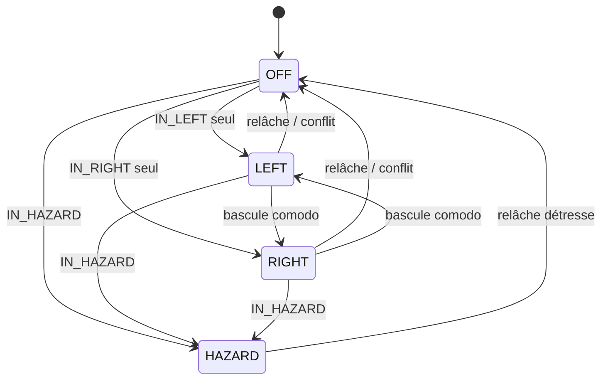
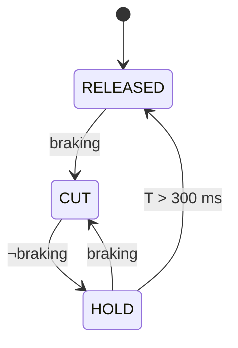
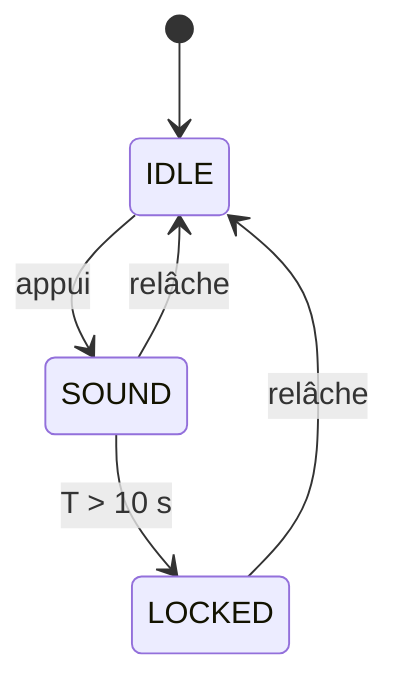

# 02 — Machines à états

Quatre automates indépendants, réévalués à chaque cycle de la boucle principale.
Aucun ne bloque, aucun n'attend.

---

## 2.1 Clignotants / détresse

### États

| État | Signification | OUT3 (gauche) | OUT4 (droite) |
|---|---|---|---|
| `OFF` | Aucune signalisation | 0 | 0 |
| `LEFT` | Clignotant gauche | phase | 0 |
| `RIGHT` | Clignotant droit | 0 | phase |
| `HAZARD` | Détresse | phase | phase |

`phase` vaut 1 pendant les 375 premières ms de chaque période de 750 ms.

### Transitions

L'état est **recalculé à chaque cycle** à partir des niveaux d'entrée (le comodo
est un inverseur maintenu, pas un bouton) :

```
si  IN_HAZARD              -> HAZARD
sinon si IN_LEFT et non IN_RIGHT  -> LEFT
sinon si IN_RIGHT et non IN_LEFT  -> RIGHT
sinon                             -> OFF
```

Le cas « les deux entrées actives » retombe volontairement sur `OFF` : c'est un
défaut de câblage ou de comodo, et il vaut mieux ne rien signaler que signaler
deux directions contradictoires. Ce cas lève le drapeau de défaut `FLT_TURN_CONFLICT`.



### Chronologie de la phase

Le compteur de phase est **remis à zéro à chaque changement d'état**, ce qui
garantit F-3.3 (démarrage sur une phase allumée) et évite un premier flash tronqué.

### Rappel d'oubli (F-3.7)

Un compteur démarre à l'entrée dans `LEFT` ou `RIGHT` (pas en `HAZARD`, qui est
intentionnellement durable). Au-delà de 45 s **ou** 300 m parcourus — si la
vitesse est valide — le retour sonore passe de « clic 25 ms » à « bip 150 ms »
à chaque début de phase. Les clignotants continuent normalement.

---

## 2.2 Freinage

### Entrées

`braking = FREIN_AV ∨ FREIN_AR` (après anti-rebond 15 ms).

En variante de câblage A (cf. `03-affectation-es.md`), une seule entrée est
câblée et `FREIN_AR` est ignorée.

### Automate de coupure moteur

| État | Condition d'entrée | OUT7 | Sortie |
|---|---|---|---|
| `RELEASED` | initial | 0 | `braking` → `CUT` |
| `CUT` | freinage détecté | 1 | `¬braking` → `HOLD` |
| `HOLD` | freinage relâché | 1 | après 300 ms → `RELEASED` ; `braking` → `CUT` |

L'état `HOLD` absorbe les micro-relâchements d'un levier de frein modulé et
évite que l'assistance ne se réengage par à-coups.



### Automate du feu stop

Sans l'option flash (défaut) : `stop = braking`, sans temporisation.

Avec `BRAKE_FLASH_ENABLE 1`, sur front montant de `braking` :

```
FLASH_ON (60 ms) -> FLASH_OFF (60 ms) -> ... ×3 -> SOLID
```

Un relâchement pendant la séquence l'interrompt immédiatement.

---

## 2.3 Feux rouges arrière (arbitrage PWM)

Une seule sortie PWM (`OUT5`) porte les deux fonctions. L'arbitrage est un ordre
de priorité strict, réévalué à chaque cycle :

| Priorité | Condition | Rapport cyclique |
|---|---|---|
| 1 | Freinage actif | 255 (100 %) |
| 2 | Éclairage allumé, ou `TAIL_ALWAYS_ON` | 52 (~20 %) |
| 3 | sinon | 0 |

La transition 0 → veilleuse suit une rampe de 200 ms. La transition
veilleuse → stop est **immédiate** : aucune rampe ne doit retarder le feu stop.
La transition stop → veilleuse est immédiate elle aussi, pour que le conducteur
derrière voie clairement la fin du freinage.

---

## 2.4 Klaxon

| État | OUT6 | Transition |
|---|---|---|
| `IDLE` | 0 | bouton appuyé → `SOUND` |
| `SOUND` | 1 | bouton relâché → `IDLE` ; T > 10 s → `LOCKED` |
| `LOCKED` | 0 | bouton relâché → `IDLE` |

`LOCKED` protège le klaxon et le convertisseur si le bouton reste collé ou si un
fil se met à la masse. Le drapeau `FLT_HORN_STUCK` est levé.



---

## 2.5 Lien Bafang

| État | Signification | Effet |
|---|---|---|
| `LINK_DOWN` | aucune trame valide depuis > 2 s | `speedValid = false`, télémétrie figée à 0 |
| `LINK_UP` | trames valides reçues | télémétrie exploitable |

Le passage à `LINK_DOWN` lève `FLT_BAFANG_LINK` (LED de diagnostic rapide,
journal série) mais **ne modifie aucune sortie** — principe P2.

---

## 2.6 Drapeaux de défaut

Un mot de 8 bits, publié dans le journal série et signalé par la LED D13.

| Bit | Nom | Cause |
|---|---|---|
| 0 | `FLT_TURN_CONFLICT` | clignotants gauche et droite simultanés |
| 1 | `FLT_HORN_STUCK` | klaxon maintenu > 10 s |
| 2 | `FLT_BAFANG_LINK` | pas de trame valide depuis 2 s |
| 3 | `FLT_BRAKE_STUCK` | freinage maintenu > 120 s (contacteur collé) |
| 4 | `FLT_LOOP_SLOW` | temps de cycle > 10 ms observé |
| 5 | `FLT_WDT_RESET` | le dernier reset provient du chien de garde |
| 6 | `FLT_BRAKE_NEVER` | plus de 2 km parcourus sans jamais voir de freinage (fil coupé ?) |
