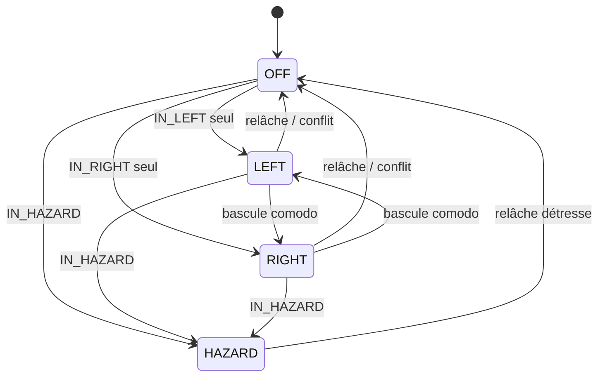
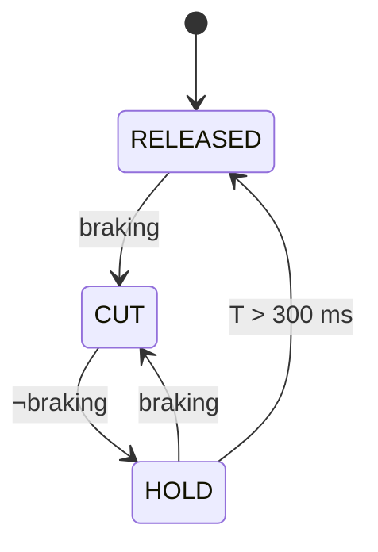

# 02 — Machines à états

Quatre automates indépendants, réévalués à chaque tour de boucle. Aucun ne
bloque, aucun n'attend.

---

## 2.1 Clignotants / détresse

| État | Signification | R3 (gauche) | R4 (droite) |
|---|---|---|---|
| `OFF` | Aucune signalisation | 0 | 0 |
| `LEFT` | Clignotant gauche | phase | 0 |
| `RIGHT` | Clignotant droit | 0 | phase |
| `HAZARD` | Détresse | phase | phase |

`phase` vaut 1 pendant les 375 premières ms de chaque période de 750 ms.

### Transitions

Le comodo est un **inverseur maintenu**, pas un bouton : l'état est donc
recalculé à chaque cycle à partir des **niveaux**, jamais des fronts.

```
si  IN_HAZARD                     -> HAZARD
sinon si IN_LEFT et non IN_RIGHT  -> LEFT
sinon si IN_RIGHT et non IN_LEFT  -> RIGHT
sinon                             -> OFF
```

Le cas « les deux entrées actives » retombe volontairement sur `OFF` : c'est un
défaut de câblage ou de comodo, et **il vaut mieux ne rien signaler que
signaler deux directions contradictoires**. Ce cas lève `FLT_TURN_CONFLICT`.



Le compteur de phase est **remis à zéro à chaque changement d'état**, ce qui
garantit F-3.3 (démarrage sur une phase allumée) et évite un premier flash
tronqué à la bascule gauche / droite.

### Retour sonore

Aucun buzzer. Les clignotants sont portés par R3 et R4, dont le claquement
mécanique à 1,33 Hz **est** le retour sonore — c'est le bruit d'un relais de
clignotant classique. Une sortie et un composant économisés, et le retour ne
peut pas tomber en panne indépendamment du clignotant qu'il annonce.

### Rappel d'oubli (F-3.7)

Un compteur démarre à l'entrée dans `LEFT` ou `RIGHT` — pas en `HAZARD`, qui
est intentionnellement durable. Au-delà de **45 s** ou **300 m** parcourus (si
la vitesse est valide), le rappel est levé. Les clignotants continuent
normalement ; seul leur **rythme** change.

Le boîtier est sous la coque et l'afficheur illisible en roulant : le
claquement des relais est le seul canal restant vers le conducteur. Le rappel
l'emprunte, en jouant sur le **rapport cyclique**.

| | Période | Phase allumée | Rapport | Cadence |
|---|---|---|---|---|
| Normal | 750 ms | 375 ms | 50 % | 80 c/min |
| **Rappel** | **750 ms** *(inchangée)* | **200 ms** | 27 % | **80 c/min** |

**La période ne bouge pas.** Le claquement passe d'un rythme régulier à un
rythme syncopé — nettement reconnaissable à l'oreille — alors que la cadence
reste dans la plage réglementaire 60–120 c/min. **C'est précisément pourquoi le
rappel n'accélère pas la cadence**, ce qui aurait été la solution automobile
habituelle : à 2,7 Hz on sortirait de la plage.

Contrepartie assumée : le feu est allumé 27 % du temps au lieu de 50 %, donc un
peu moins visible. Acceptable parce qu'après 45 s ou 300 m, le clignotant est
très probablement resté allumé pour rien. `BLINK_REMINDER_ON_MS 0` rend le
rappel muet et le limite au journal.

**Le clignotant n'est jamais annulé automatiquement** : le comodo est un
inverseur maintenu, et une annulation logicielle créerait une incohérence entre
la position du levier et l'état réel. On alerte, on ne décide pas à la place du
conducteur.

---

## 2.2 Freinage

`braking = FREIN_AV ∨ FREIN_AR`, après anti-rebond de 15 ms.

Les deux entrées sont des **contacts secs vers la masse** : le contacteur
unipolaire du levier avant sur `IN4`, le micro-rupteur S2 du levier arrière sur
`IN5`. Avec `BRAKE_WIRING_VARIANT 1`, seule `IN4` est câblée et `FREIN_AR` est
forcée inactive par le firmware.

> Rappel de `07` §2 : cet automate pilote R8, qui est un chemin **redondant**.
> Aux deux freins, une coupure d'assistance existe sans passer par le firmware
> — contacteur Bafang d'origine à l'arrière, diode D1 à l'avant.

### Automate de coupure moteur

| État | Condition d'entrée | R8 | Sortie |
|---|---|---|---|
| `RELEASED` | initial | 0 | `braking` → `CUT` |
| `CUT` | freinage détecté | 1 | `¬braking` → `HOLD` |
| `HOLD` | freinage relâché | 1 | après 300 ms → `RELEASED` ; `braking` → `CUT` |

L'état `HOLD` absorbe les micro-relâchements d'un levier modulé : sans lui,
l'assistance se réengagerait par à-coups en plein freinage.



### Automate du feu stop

Sans l'option flash (défaut) : `stop = braking`, sans aucune temporisation.

Avec `BRAKE_FLASH_ENABLE 1`, sur front montant de `braking` :
`FLASH_ON (60 ms) → FLASH_OFF (60 ms) → … ×3 → SOLID`. Un relâchement pendant
la séquence l'interrompt immédiatement.

Un freinage maintenu plus de **120 s** lève `FLT_BRAKE_STUCK` : contacteur
vraisemblablement collé.

---

## 2.3 Feux rouges arrière — deux circuits

Les sorties sont des relais : aucune modulation n'est possible. Les deux
fonctions occupent donc **deux relais et deux circuits distincts**, comme un
feu automobile à deux filaments.

| Relais | Fonction | Condition |
|---|---|---|
| R5 | Feux de position | `IN_PARK` **ou** `IN_MAIN`, ou `TAIL_ALWAYS_ON` |
| R6 | Feu stop | freinage actif |

> Le **ou** de la première ligne n'est pas configurable, et c'est délibéré :
> aucune combinaison de commandes ne doit permettre de rouler éclairé à l'avant
> sans feu rouge arrière (F-1.7).

Il n'y a plus d'arbitrage : les deux sont indépendants et peuvent être allumés
simultanément. La différenciation visuelle repose donc entièrement sur le
**matériel** — le feu stop doit être nettement plus lumineux que le feu de
position. À valider au test T3.3.

---

## 2.4 Voyant de défaut et acquittement

La voie `IN3` / `R7` porte le diagnostic au poste de conduite. Pas d'automate à
proprement parler, mais trois règles qui se combinent.

### Quels défauts allument le voyant

`FAULT_LAMP_MASK` (0x6B) sépare ce qui interrompt le conducteur de ce qui
attend l'ouverture de la coque.

| Bit | Défaut | Voyant | Pourquoi |
|---|---|---|---|
| 0 | Conflit clignotants | **oui** | La signalisation de direction est perdue |
| 1 | Voie auxiliaire bloquée | oui | Sans objet tant qu'il n'y a pas de klaxon |
| 2 | Lien Bafang perdu | **non** | Confort, pas sécurité — voir ci-dessous |
| 3 | Frein collé | **oui** | Assistance coupée en continu, stop allumé en permanence |
| 4 | Cycle lent | non | Information de maintenance |
| 5 | Reset chien de garde | **oui** | Les feux se sont éteints ~1,5 s en roulant |
| 6 | Aucun freinage vu en 2 km | **oui** | Fil de contacteur probablement coupé : le feu stop ne fonctionne pas |

> **L'exclusion du lien Bafang est la décision de conception de ce module** —
> le principe P2 appliqué. Afficheur débranché, bus muet ou trames non
> reconnues, le voyant resterait allumé en permanence ; et un voyant toujours
> allumé est un voyant qu'on cesse de regarder, ce qui vaut moins que pas de
> voyant du tout. Ces défauts restent lisibles sur la page « défauts » et au
> journal.
>
> La règle est vérifiée **à la compilation** par un `static_assert` dans
> `diag.cpp` : on ne peut pas l'annuler sans lire sa justification.

### Allumage fixe, jamais clignotant

Un relais n'est pas fait pour battre — c'est déjà ce qui fait de R3 et R4 les
pièces d'usure du montage. La discrimination entre défauts se lit sur
l'afficheur, coque ouverte.

Il s'allume aussi **200 ms pendant l'autotest de mise sous tension**, comme un
témoin de tableau de bord au contact : sans cela, une LED grillée serait
indiscernable d'une absence de défaut.

### Acquittement

```
Appui sur IN3 (front montant, anti-rebond 20 ms)
  ├─ efface les défauts MÉMORISÉS (bits 4 et 5)
  │    sinon ils survivraient jusqu'à la coupure de l'alimentation
  └─ marque acquittés les défauts ENCORE ACTIFS
       voyant éteint, mais afficheur et journal inchangés

À chaque cycle :  acquittés &= défauts_actifs
       un défaut qui disparaît perd son acquittement
```

Cette dernière ligne donne à l'acquittement sa sémantique correcte : il porte
sur **un événement, pas sur une catégorie**. Un conflit de clignotants acquitté
puis résolu rallumera le voyant s'il se reproduit.

### La contrainte de sûreté

`IN3` est le **seul organe que le conducteur peut actionner en roulant** en
dehors des commandes d'éclairage. Il ne touche que `diag` : aucun effet sur les
feux, les freins ou la coupure moteur. Ce n'est pas un hasard de conception
mais une exigence (F-4.8), vérifiable par revue de code — `acknowledge()`
n'écrit que sur `g_faults` et `g_acked`.

---

## 2.5 Lien Bafang

| État | Signification | Effet |
|---|---|---|
| `LINK_DOWN` | aucune trame valide depuis > 2 s | `speedValid = false`, télémétrie figée à 0 |
| `LINK_UP` | trames valides reçues | télémétrie exploitable |

Le passage à `LINK_DOWN` lève `FLT_BAFANG_LINK` — journal série et page
« défauts » — mais **ne modifie aucune sortie** et **n'allume pas le voyant**
(P2).

---

## 2.6 Drapeaux de défaut

Un mot de 8 bits, publié au journal série (`flt=0x..`), lisible sur la page
« défauts » de l'afficheur, et signalé — pour les bits du masque — par le
voyant R7. Le **point décimal du digit de gauche** bat à ~4 Hz au lieu de 1 Hz
dès qu'un défaut quelconque est actif ; la LED D13 du Nano n'est pas
utilisable comme témoin (`03` §2).

| Bit | Nom | Cause |
|---|---|---|
| 0 | `FLT_TURN_CONFLICT` | clignotants gauche et droite simultanés |
| 1 | `FLT_HORN_STUCK` | voie auxiliaire bloquée > 10 s — jamais levé tant que `HORN_ENABLE` vaut 0 |
| 2 | `FLT_BAFANG_LINK` | pas de trame valide depuis 2 s |
| 3 | `FLT_BRAKE_STUCK` | freinage maintenu > 120 s (contacteur collé) |
| 4 | `FLT_LOOP_SLOW` | temps de cycle > 10 ms observé — **mémorisé** |
| 5 | `FLT_WDT_RESET` | le dernier reset provient du chien de garde — **mémorisé** |
| 6 | `FLT_BRAKE_NEVER` | plus de 2 km parcourus sans jamais voir de freinage |

Les deux défauts **mémorisés** sont des événements, pas des états : ils
survivent jusqu'à l'acquittement ou la coupure de l'alimentation. Les cinq
autres sont recalculés à chaque cycle.
